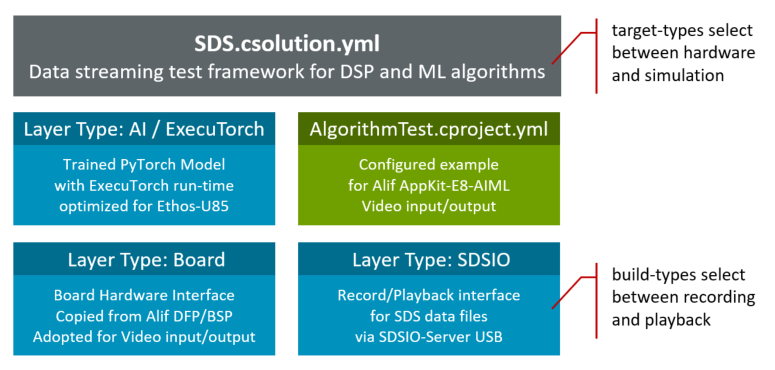
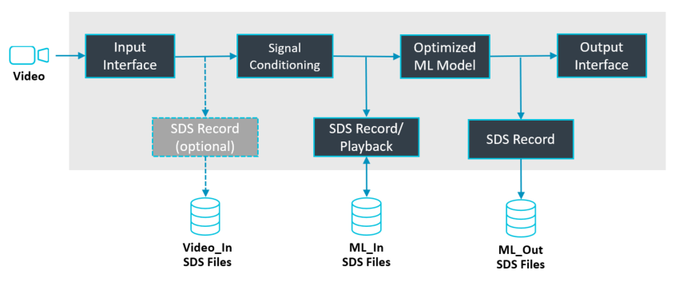
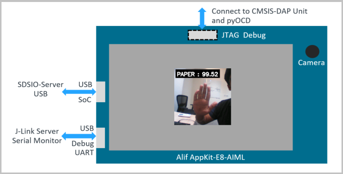
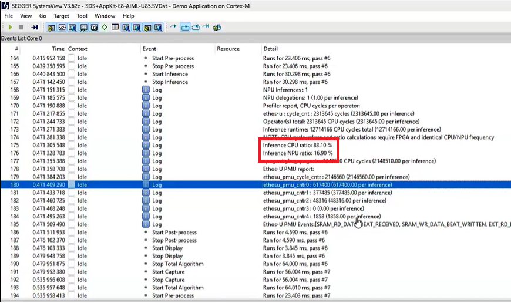
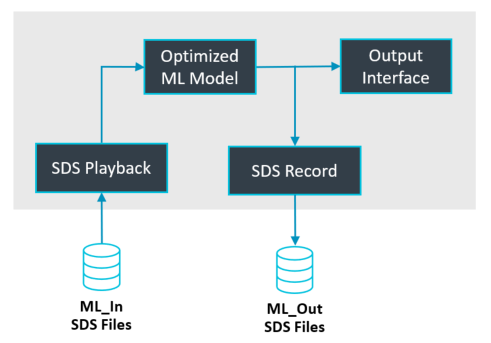

# Edge AI Project

The RockPaperScissors project implements an AI model that detects [three hand gestures](https://en.wikipedia.org/wiki/Rock_paper_scissors). It runs on an [Alif AppKit-E8-AIML](https://www.keil.arm.com/boards/alif-semiconductor-appkit-e8-aiml-a-b437af7/features/) that offers camera input and an LCD display. The SoC USB interface connects the board to a host computer for data capture and playback using the SDS Framework.

## Overview

The project uses software layers to decouple functionality as shown in the diagram below. The target type `AppKit-E8-U85` or `SSE-320-U85` selects the board layer for hardware or the simulation model. Using a different AI/ExecuTorch layer would change the AI model behavior.



The application uses standardized interfaces that are provided by the board layer `Board/AppKit-E8_M55_HP/Board_HP-U85.clayer.yml`.

- [CMSIS-Driver vStream](https://arm-software.github.io/CMSIS_6/latest/Driver/group__vstream__interface__gr.html) is an interface for streaming data with fixed-size data blocks. It is used for camera input (source file `vstream_video_in.c`) and optionally for LCD output (source file `vstream_video_out.c`).
- [CMSIS-Driver USB Device](https://arm-software.github.io/CMSIS_6/latest/Driver/group__usbd__interface__gr.html) implements the USB communication interface to the SDSIO-Server. It is provided by the component `CMSIS Driver:USB Device`.

The file `sds_main.c` implements the inference loop. This is the pseudocode for the operation.

```c
  while (1)  {
    GetInputData ();       // Get a camera image as required by the AI model
    sdsRecWrite ();        // Record the camera image in an SDS data file
    ExecuteAlgorithm ();   // Execute AI model inference and output RPS classification result
    sdsRecWrite ();        // Record the AI model output in an SDS data file
  }
```



The overall data flow of the application is:

Data Flow                     | Where          | Description
:----------------------------:|:--------------:|:--------------------------------------------------
Camera input<br/>▼            | Layer Board    | Software component `Device:SOC Peripherals:CPI` implements the camera interface.
vstream_video_in<br/>▼        | Layer Board    | Source file `vstream_video_in.c` converts the camera input to a data stream.
GetInputData<br/>▼            |  Project       | Source file `sds_data_in_user.c` implements `GetInputData()`, which gets a camera image and converts it into the AI model input.
ExecuteAlgorithm<br/>▼        |  Project       | Source file `sds_algorithm_user.cpp` implements `ExecuteAlgorithm()`, which calls `run_inference()`.
run_inference<br/>▼           |  Project       | Source file `arm_executor_runner.cc` implements `run_inference()`, which pushes the current input tensor bytes into ExecuTorch and runs `execute()`.
execute<br/>▼                 | Layer AI Model | Executes the AI model (the `execute` method is part of ExecuTorch).
postprocess                   |  Project       | Source file `sds_algorithm_user.cpp` calls `postprocess()` to print the results.

The project runs on the [Alif AppKit-E8-AIML](https://www.keil.arm.com/boards/alif-semiconductor-appkit-e8-aiml-a-b437af7/features/).

- The USB SoC interface connects to the [SDSIO-Server](https://arm-software.github.io/SDS-Framework/main/utilities.html#sdsio-server) and is used to record and play back SDS files.
- The USB Debug/UART interface connects via J-Link to the [Keil Studio Debugger](https://marketplace.visualstudio.com/items?itemName=Arm.keil-studio-pack) and via [Serial Monitor](https://marketplace.visualstudio.com/items?itemName=ms-vscode.vscode-serial-monitor) to the application's UART output.
- Optionally, a CMSIS-DAP adapter (for example, ULINKplus) connects to pyOCD for debugging and testing. This setup is used for [regression testing](#regression-test) in a hardware-in-the-loop (HIL) system.



## Input Interface and Signal Conditioning

This section explains how the camera input interface with signal conditioning is implemented for the [Alif E8 AppKit](https://www.keil.arm.com/boards/alif-semiconductor-appkit-e8-aiml-a-b437af7/features/).

### GetInputData

The file `sds_data_in_user.c` implements the AI model input interface and signal conditioning. In this project, it crops and resizes the camera input.

The function `GetInputData()` is called once per inference cycle to produce one input block for the AI model. It starts a single-shot video capture, waits on an RTOS thread flag until a frame is available, retrieves the raw camera frame, converts it, crops/resizes it to the AI model input dimensions (`ML_IMAGE_WIDTH × ML_IMAGE_HEIGHT × 3` bytes), then releases the frame buffer.

- The camera format is configured in the file `algorithm/config_video.h`.
- The AI model format is configured in the file `algorithm/config_ml_model.h`.

### Capture AI Model Input Data

To capture AI model input data, build the project `AlgorithmTest` with [Build Type: DebugRec](https://arm-software.github.io/SDS-Framework/main/template.html#build-the-template-application).

When running the application on the target, you may capture the input data with the SDS Framework. Use these steps:

1. Start [SDSIO-Server](https://arm-software.github.io/SDS-Framework/main/utilities.html#sdsio-server) on your host computer with `sdsio-server usb`.
2. Connect the host computer to the SoC USB port.
3. Start and stop recording using the joystick push-button, or by sending the `s` character to the board via the STDIO (UART4) interface.

**Example console output:**

```txt
>sdsio-server usb
Press Ctrl+C to exit.
Starting USB Server...
Waiting for SDSIO Client USB device...
SDSIO Client USB device connected.
Ping received.
Record:   DataInput (.\DataInput.0.sds).
Record:   DataOutput (.\DataOutput.0.sds).
............
Closed:   DataInput (.\DataInput.0.sds).
Closed:   DataOutput (.\DataOutput.0.sds).
```

Using [SDS-Convert](https://arm-software.github.io/SDS-Framework/main/utilities.html#sds-convert) with a configured [image metadata](https://arm-software.github.io/SDS-Framework/main/theory.html#image-metadata-format) file (available in `RockPaperScissors/SDS_Metadata`) allows you to convert the data stream into an MP4 video file.

```txt
>sds-convert video -i DataInput.0.sds -o DataOutput.0.mp4 -y RockPaperScissors/SDS_Metadata/RGB888.sds.yml
Video conversion complete: 30 frames written to DataOutput.0.mp4
```

> [!TIP]
> Open the generated MP4 file with a video player to review the captured camera images.

## Create AI Model

This section explains how the AI model is created with the ModelNova Fusion Studio.

ToDo (i.e.)

- select model
- use training data
- create an optimized model for deployment to Cortex-M/Ethos-U microcontrollers.
- view report
- obtain the AI model

## Integrate AI Model

The folder `ai_layer` contains the AI model that is created as described above. The integration is based on the PyTorch [Arm Ethos-U NPU backend](https://docs.pytorch.org/executorch/1.0/backends-arm-ethos-u.html). The file `sds_algorithm_user.cpp` implements `ExecuteAlgorithm()`, which calls `run_inference()` in [`arm_executor_runner.cc`](https://github.com/pytorch/executorch/tree/main/examples/arm/executor_runner), which is derived from PyTorch. This file then calls the `execute` method in `ai_layer`.

### Check AI Model Performance

The AI model input data and output data can now be verified. Run the project `AlgorithmTest` with [Build Type: DebugRec](https://arm-software.github.io/SDS-Framework/main/template.html#build-the-template-application) on the target hardware and use `sdsio-server usb` to capture both the `ML_In` and `ML_Out` SDS files.

**Example console output:**

ToDo

### Measure Timing

ToDo



## Capture New Data

This section explains how additional training data and AI model output data are captured with the SDS framework.

## Retrain AI Model

This section explains how the AI model is retrained with additional training data.

## Regression Test

Regression testing verifies that an updated AI model still matches a fixed reference dataset before deployment. In this setup, recorded inputs (`ML_In.*.sds`) are replayed through SDSIO and the results are compared against the reference outputs (`ML_Out.*.sds`) within a defined tolerance. Run this after every retrain to catch accuracy regressions from architecture, training data, or quantization changes.

The build type `DebugPlay` configures the application for SDS data playback and includes only a subset of the application as outlined in the picture below.



There are two possible target types for SDS data playback:

- Target type `SSE-320-U85` runs on the Corstone-320 FVP simulation model and verifies the correctness of the operation. Simulation models are easy to deploy and do not require any hardware.

- Target type `AppKit-E8-U85` runs on the Alif AppKit-E8 target hardware and uses pyOCD with a CMSIS-DAP unit for hardware-in-the-loop (HIL) testing. Besides correctness, timing can also be verified by capturing an RTT file for the SEGGER SystemView tool.


ToDo
