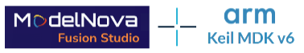

**Work in Progress**

This repository shows how to build **Edge AI applications with Cortex-M/Ethos-U-based microcontrollers**. It uses [ModelNova](https://modelnova.ai/) for AI model development and [Keil MDK](https://www.keil.arm.com/) for embedded development.

## Learn more at Embedded World 2026

### Arm: Hall 4-504

Application development, data capture, and workload analysis of an Edge AI system based on [Alif E8](https://www.keil.arm.com/packs/ensemble-alifsemiconductor).

### ModelNova: Hall 4-600

AI model selection, data labeling, and model creation for an Edge AI system based on [Alif E8](https://www.keil.arm.com/packs/ensemble-alifsemiconductor).

### Exhibitor forum: Hall 5-210 on Wed, 03/11/2026, 09:30 - 10:00

[From model to market: accelerated AI development on Arm](https://www.embedded-world.de/en/conferences-programme/2026/exhibitor-forum/from-model-to-market-accelerated-ai-development). This talk explains the overall AI model development workflow.

## AI model development

The diagram below shows the overall development of an AI model that is integrated into an embedded system. During AI model development, the [SDS framework](https://www.keil.arm.com/packs/sds-arm/overview/) is used as a workbench for data capture and system analysis. Once the optimized model delivers the expected performance, it can be integrated into the final application that may be based on FreeRTOS, Keil RTX, or Zephyr.

### Initial development steps

1. [Create the input interface](./Documentation/README.md#input-interface-and-signal-conditioning), add signal conditioning, and start capturing data for AI model training.
2. [Select an AI model](./Documentation/README.md#create-ai-model), then use the captured data for training, analysis, and creation of the optimized AI model.
3. [Integrate the AI model](./Documentation/README.md#integrate-ai-model) into the SDS framework and analyze performance.

### Refine AI model development

1. [Capture new data](./Documentation/README.md#capture-new-data) where the AI model does not deliver the expected results.
2. [Retrain the AI model](./Documentation/README.md#retrain-ai-model) using additional training data to optimize performance.
3. [Add regression testing](./Documentation/README.md#regression-test) before integrating a new AI model into the embedded system.

## Quick Start

The [RockPaperScissors](./Documentation/README.md) project implements an AI model that detects [three hand gestures](https://en.wikipedia.org/wiki/Rock_paper_scissors) ([RPS_cls_dataset](./RockPaperScissors/RPS_cls_dataset/) provides test data). The [`AppKit-E8_USB/SDS.csolution.yml`](./RockPaperScissors/AppKit-E8_USB/SDS.csolution.yml) project uses the SDS framework for testing the AI model on the Alif AppKit-E8 hardware or an Arm FVP simulation model.

### Keil MDK

1. Install [Keil Studio for VS Code](https://marketplace.visualstudio.com/items?itemName=Arm.keil-studio-pack) from the VS Code marketplace.
2. Clone this repository (for example using [Git in VS Code](https://code.visualstudio.com/docs/sourcecontrol/intro-to-git)) or download the ZIP file. Then open the base folder in VS Code.
3. Open the [CMSIS View](https://mdk-packs.github.io/vscode-cmsis-solution-docs/userinterface.html#2-main-area-of-the-cmsis-view) in VS Code, use *Open Solution in Workspace* (... menu), and choose `RockPaperScissors/AppKit-E8_USB/SDS.csolution.yml` to open the project.
4. The related tools and software packs are downloaded and installed. Review progress with *View - Output - CMSIS Solution*.
5. In the CMSIS view, use the [Action buttons](https://github.com/ARM-software/vscode-cmsis-csolution?tab=readme-ov-file#action-buttons) to build, load, and debug the example on the hardware.

> [!TIP]
> If you are new to Alif devices and boards, start with the `Blink_HP` example project using *Create Solution* with the board `Alif AppKit-E8-AIML`.

### ModelNova Fusion Studio

1. Download and install [ModelNova Fusion Studio](https://modelnova.ai/fusion-studio-beta).
2. ...

## Issues or Questions

Use the [**Issues**](./issues) tab to raise questions or issues.
